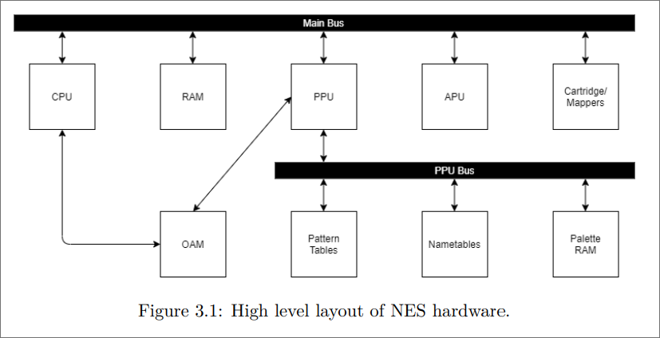

# 1. 6502

[source 1](https://jayscholar.etown.edu/cgi/viewcontent.cgi?article=1000&context=comscistu)
[source 2](https://www.nesdev.org/NESDoc.pdf)
[Source 3](https://www.cs.jhu.edu/~phi/csf/slides/lecture-6502-stack.pdf)

## 1.1. Overview

- The 6502 is an ***8-bit*** microprocessor from 1975.

- The NES used a variation of the 6502 called the Ricoh 2A03, which had two differences:
  - lacked the 6502 decimal mode.
  - Has an audio processing unit in the chip.


# 2. NES Layout



- Above is a high level overview of the NES.

## 2.1. The Main bus

- Remember, a bus is just a series of wires, traces on a motherboard, which connect all the hardware components, and allows for communication among devices.
- Different devices are placed along different address spaces of the bus.
  - This is called memory mapping.
    - This ensures the processor can R/W to and from valid memory locations.

| Address Range | Total Size (In bytes) | Device     |
| ------------- | --------------------- | ---------- |
| 0x0000-0x07ff | 0x0800                | RAM        |
| 0x2000-0x2007 | 0x0008                | PPU        |
| 0x4000-0x4017 | 0x0018                | APU        |
| 0x4020-0xffff | 0xbfe0                | Cart./Map. |

- What's interesting about this, we're using 16 bit memory addresses for the ram, but this is an ***8 bit processor***, which is quirky.
  - This means it can only address from 0x00 - 0xFF
- Some devices will have mirrored addresses.

## 2.2. RAM

- RAM, or Random Access Memory, is fast, volatile computer memory.
  - Volatile, aka, you lose data when system is off.
  - It's faster than non volatile memory.

## 2.3. APU

- The Audio Processing Unit, APU, handles the sounds and music on the NES.
  - Despite the APU being inside the CPU, it's treated like every other device.
- The NES APU has 5 voices:
  - 1 voice for noise.
  - 1 triangle wave voice.
  - 2 pulse wave voices
  - 1 voice for sample playback.


## 2.4. PPU

- This is the Picture Processing Unit.
  - It's a basic graphics card, and it handles rendering pixels to the screen.
- It's essentially a co--processor, but specifically for graphics rendering.
  - The PPU has it's own bus.

## 2.5. PPU Bus

- The PPU Bus is only accessible by the PPU
  - It's a 16kb addressa space, so it has a range of 0x0000-0x3fff
    - In this space, it contains graphic specific memory for the PPU.
- The Pattern Table stores all the shapes and tiles which make up the sprites and background for games.
- nametable is used to layout our background tiles for the game in the correct order.
- Palette RAM stores what color palette the back tiles will use, and the color palette for the sprites.


## 2.6. OAM

- The OAM, or object attribute memory, is a special address space within the PPU that's directly accessible by the CPU.
  - The OAM keeps track of where sprites get rendered on the screen.
- As you noticed, the CPU only has 8 addresses to communicate with the PPU on the bus.
  - With these few addresses, it's not fast.
    - Fortunately, the OAM provides a form of Direct Memory Access for both the CPU and PPU, hence speeding up communication.

## 2.7. Cartridge Space & Mappers

- The cartridge space is the space where CPU reads in game data from the cartridge.
- The cartridge is ROM, Read Only Memory.

***Mapper***

- Later NES games had a mapper.
  - This allows the CPU to configure certain aspects of the cartridge to perform memory banking.
    - This allowed for games over 40kb 
  - You know there's a limited address space for accessing the cartridge.
    - The mapper will have two different memory spaces inside the cartridge. The CPU can tell the mapper which memory space to map onto.
    - From the CPU perspective, it's reading the same address.


# 3. CPU Goodness:

## Registers

- The 6502 has 6 registers:
  - PC: Program counter, 16 bit
  - SP: Stack Pointer, 8 bits
  - A: Accumulator
  - X: X register
  - Y: Y register
  - Flag: Flag register


## Instructions

- We're going to make a struct containing:
  - function pointer to addressing mode
  - function pointer to instruction
  - number of clock cycles, maybe special cases.
  - number of bytes to read.


### Clock Cycles?

- So, the NES ran at 1.79 MHz, so we need to do some math.

$1.79 MHz = 1790000 Hz$

$\frac{1790000 \text{instructions}}{\text{second}} \times \frac{\frac{1}{1790000}}{\frac{1}{1790000}}$ bla bla bla.

- So, each clock cycle will cost 1/1790000 seconds.


## Interrupts

- When you get an interrupt, your CPU will attend to it.
  - Interrupts are usually generated by hardware, but can be triggered by software.

- On the NES, there are 3 types of interrupts:
  - NMI
  - IRQ
  - RESET
- There's a vector table containing the addresses of where to go in these scenarios at address FFFA-FFFF. 

**pseudocode, kinda?**

```
- recognize interrupt
- complete current instruction
- push program counter and status register onto stack.
- set the interrupt disable flag to prevent further interrupts
- load address of the interrupt handling rountine from vector table into program counter.
- execute the routine.
- After execute RTI (return from interrupt):
  - pull PC and status register values from stack
- resume program.
```

### Interrupt types

#### IRQs

- These are your maskable interrupts
  - These interrupts would be triggered by certain memory mappers.
- The CPU will ignore if the interrupt disable flag is set.
- IRQs can be triggered by using the BRK instruction.
- The system will jump to address **located** at FFFE and FFFF

#### NMIs

- These are non-maskable interrupts.
- This interrupt is develop by the PPU when "V-Blank" occurs at the end of each frame.
- NMIs are **not** affected by interrupt disable bit in status register.
  - AKA, they'll always interrupt execution.
- **HOWEVER**, triggering an NMI can be prevented if bit 7 of PPU control register 1 ($2000) is clear.
- When an NMI interrupt occurs, the system will jump to the address located at FFFA and FFFB.

#### Resets

- These happen when the system first starts, or when the user presses the reset button.
  - Reset will jump to address located at FFFc and FFFD.

### Logistics bout resets

- The sytsem will give highest priority to reset requests, followed by NMI and IRQ.
- The NES has an interrupt latency of 7 cycles, so it'll take 7 CPU cycles to begin executing the interrupt handler.


### To compile 6502 
```
cl65 --verbose --target nes wrapper.s examples/01_XandY.s ; mv wrapper wrapper.nes
```