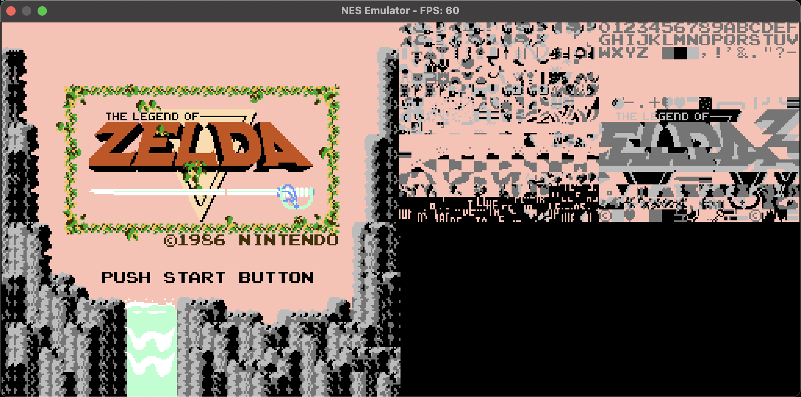
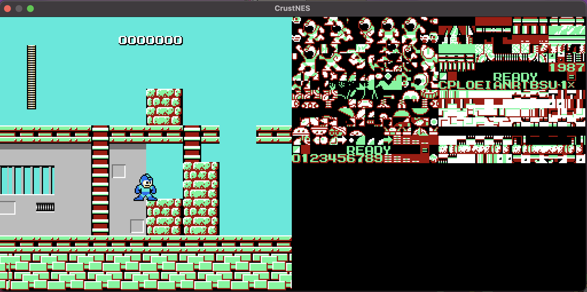
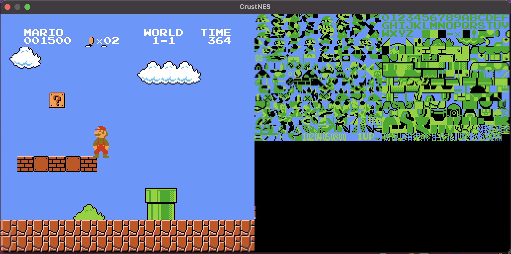
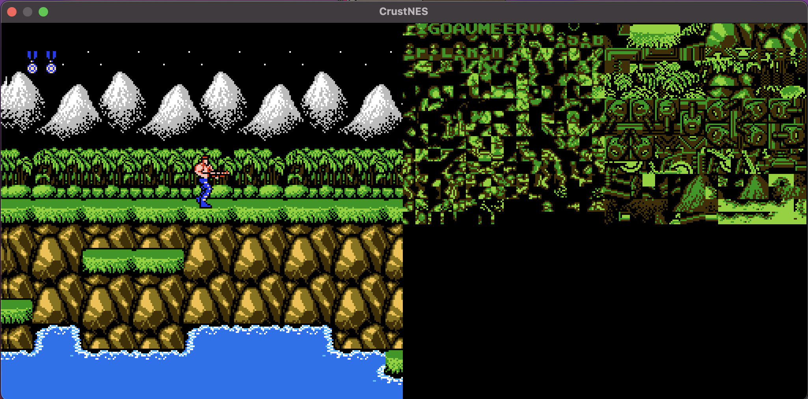
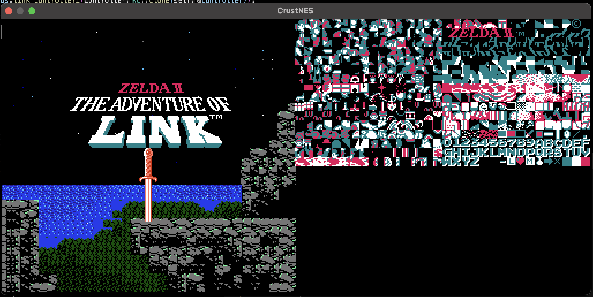

# note: this project is deprecated

I wrote this emulator almost two years ago, and of all the projects I’ve worked on, it’s my pride and joy. I learned Rust through this project, and it was definitely valuable to have on my résumé. I like to think of myself as having a “pre-internship” and “post-internship” phase. The Pre-internship me built this without much consideration for standard software engineering practices—clean commit history, robust logging, or effective debugging infrastructure. I later tried to add logging to the project, but by then it wasn’t practical; it felt like trying to put out a forest fire with a glass of water. For that reason, I’m officially declaring this project **deprecated**. The emulator still works, but it lacks DMC channel support, and there’s a known PPU bug where the leftmost eight columns render incorrectly. If you’d like, feel free to fork and build on this codebase—but be warned, it won’t be easy.

<h1 align="center">NES Emulator</h1>


An NES emulator is fully written in Rust.

<p align="center">
  
  
  
  
  
</p>

<h2 align="center">Introduction</h2>

This project is a Nintendo Entertainment System emulator written entirely in Rust. I began working on it in December 2023 but only found the motivation to push through and complete it in March 2024. Currently, the emulator supports Mappers 000, 001, and 002, with plans to add more.

<h2 align="center">Installation</h2>


If you are curious or brave enough to try it out, here is how you can get started:

### 1. Install Rust

If you have not already, install Rust using [rustup](https://www.rust-lang.org).

### 2. Clone the Repository

```bash
git clone https://github.com/AFE123x/NES-Emulator
cd NES-Emulator
```

### 3. Run the Emulator

```bash
cargo run --release 
```

You will be prompted to select a ROM file (make sure it is one you legally own and backed up!).

<h2 align="center">Controls</h2>

Controls are currently hardcoded and may feel unconventional:

| Key         | NES Button         |
|-------------|--------------------|
| Up          | D-Pad Up           |
| Down        | D-Pad Down         |
| Left        | D-Pad Left         |
| Right       | D-Pad Right        |
| A           | A Button           |
| O           | B Button           |
| E           | Select             |
| U           | Start              |
| `;` or `S` | Save PRG RAM (Mapper 001 only) |
| `L` or `P` | Load PRG RAM (Mapper 001 only) |

<h2>Roadmap</h2>

This emulator is a work in progress, and there is still a lot I want to explore and implement:

- ✅ Replace SDL2 with `minifb`
- ✅ Optimize PPU background rendering
  - ✅ Implement Loopy register scrolling
  - ✅ Fix name table rendering issues in Super Mario Bros
- ✅ Validate all CPU instructions (some flags still need verification)
  - update: tested and verified with the single step processor tests (official and unofficial opcodes)
- 🔲 Implement Mappers
  - ✅ Implement Mapper 001
  - ✅ Implement Mapper 001
  - ✅ Implement Mapper 002
  - 🔲 Implement Mapper 004
  - 🔲 Implement the other Mappers
- ✅ Audio emulation
  - I need to actually modify pulse 1 and 2 to use pulse waves. Implement "immediate unmute".
- ✅ Implement a basic debugger
- ✅ Second controller support (implemented, but want it to be supported by network.)
- 🔲 Network multiplayer support (netplay)
- 🔲 Cloud save / AWS integration (just an idea... maybe?)

## Contributing

Contributions are more than welcome! Feel free to open a pull request, whether it is fixing a bug, adding a feature, or improving documentation. There is plenty of work to be done, and I would love the help.