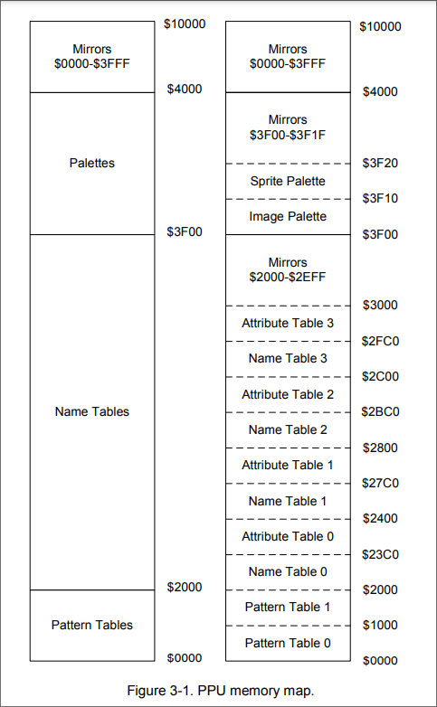

- The NES uses the 2C02 Picture Processing Unit.
	- The PPU handles the graphics stuff.
- The PPU has registers located in the CPU's memory from address $2000-$2007, and $4014.


## Memory map

- The PPU also has it's own memory, VRAM.
	- The PPU can also address 64kb of memory, but there's only 16kb of physical RAM. Below is the memory map for the PPU.




## PPU Registers

- The PPU has eight memory mapped registers to the PPU, located at address $2000 to $2007.
	- The addresses are mirrored every 8 bytes, from $2008 to $3FFF.
- The PPU will start rendering immediately, but it'll ignore writes to most registers, until it reaches the pre render scan line of the next fram.
	- AKA, it'll not write for around 29658 CPU cycles for NTSC, which we assume CPU and PPU reset at same time.

## $2000 - Controller > write

- This is the PPU Control register (Commonly named PPUCTRL), which only has **write** access.


- The flagas for controlling PPU Operations
```bash
7  bit  0
---- ----
VPHB SINN
|||| ||||
|||| ||++- Base nametable address
|||| ||    (0 = $2000; 1 = $2400; 2 = $2800; 3 = $2C00)
|||| |+--- VRAM address increment per CPU read/write of PPUDATA
|||| |     (0: add 1, going across; 1: add 32, going down)
|||| +---- Sprite pattern table address for 8x8 sprites
||||       (0: $0000; 1: $1000; ignored in 8x16 mode)
|||+------ Background pattern table address (0: $0000; 1: $1000)
||+------- Sprite size (0: 8x8 pixels; 1: 8x16 pixels)
|+-------- PPU master/slave select
|          (0: read backdrop from EXT pins; 1: output color on EXT pins)
+--------- Generate an NMI at the start of the vertical blanking interval.

```
- The Vertical interval blanking is the time between the end of the visible line of frame, and beginning of the first visible line of the next frame/field.
	- AKA, you'd want to mess with graphics during this time.
- Another to look at the 2 least significant bits is:

```
7  bit  0
---- ----
.... ..YX
       ||
       |+- 1: Add 256 to the X scroll position
       +-- 1: Add 240 to the Y scroll position
```
- Changing the name table is required when scrolling.
- When the V-Blank flag is set, meaning the PPU is currently in verticle blank, changing the NMI flag in bit 7 of 2000 will generate an NMI. 
	- To prevent this, you need to clear the vblank flag before writing to 2000 to enable NMI.
- We'll ignore the master/slave bit.
- You want to be careful writing to the PPUCTRL register outside vertical blanking in vertical mirror or 4 screen vram mode.
	- Writing outside vertical blanking, may cause the name table to  be drawn inccorectly from the left nametable, leading to visible glitches.
		- It'll also mess with sprite 0 hit detection for the scan line.
	- This glitch only happens to dot 257 and 258. other horizontal lines are fine.


## PPU Mask $2001

- This is the PPUMASK register, only has write access.
- This register handles the rendering of sprites and backgrounds, in addition to color effects

```
7  bit  0
---- ----
BGRs bMmG
|||| ||||
|||| |||+- Greyscale (0: normal color, 1: produce a greyscale display)
|||| ||+-- 1: Show background in leftmost 8 pixels of screen, 0: Hide
|||| |+--- 1: Show sprites in leftmost 8 pixels of screen, 0: Hide
|||| +---- 1: Show background
|||+------ 1: Show sprites
||+------- Emphasize red (green on PAL/Dendy)
|+-------- Emphasize green (red on PAL/Dendy)
+--------- Emphasize blue
```

- bit 1 and 2 will show the sprite/background in the leftmost 8 bit column, setting it to zero will not render them.
	- This is used in horizontal scrolling situations, so sprites can be partially shown instead of disappearing.
- Bit 3 and 4 will enable/disable the rendering of the backround and sprites.
- as mentioned before, this should only be messed with only during v blanks.
- if either of bit 3 or four is enable, outside the vblank interval, the PPU will make continual use to the PPU address and data bus to fetch tiles to render, and sprites from the OAM.
	- To modify the PPU memory outside vblank, you should set 3 and 4 to 0.
- Bits 5,6 and 7 emphasize the colors. AKA, tint.


## Status Register - $2002

- This is the PPU status register, has **read** access.
- This register reflacts the state of various functions inside the PPU.
## Color Palette:

- The NES has a color palette, which can store 52 colors.
	- Even though there's space for 64, we say 52 colors :-D
- THe NES uses two palettes, each with 16 entries.
	- Image palette: $3F00 - $3F0F
		- This palette shows colors available for background tiles.
	- Sprite palette $3F10 - $3F1F
		- THis shows colors available for sprites.
	- These palette don't have the color values, but an index of the color in the system palet.
- The first entry, 0x3F00, is the background color, used for transparency. Mirroring here is used, so every four bytes is a copy of $3F00


## Pattern Tables

- The NES has two pottern tables at addresses $0000 and $1000. These tables store 8x8 pixel tiles which can be drawn on the screen. The pattern tables are usually in CHR-ROM.
	- games without CHR-ROM will use ram for the pattern table, and fill em during execution.


The pattern will store the least significant bit in the first byte, and most significant in the second byte.

```

-----------lo bit------------
$0000  0  0  0  1  0  0  0  0
$0001  0  0  0  0  0  0  0  0
$0002  0  1  0  0  0  1  0  0
$0003  0  0  0  0  0  0  0  0
$0004  1  1  1  1  1  1  1  0
$0005  0  0  0  0  0  0  0  0
$0006  1  0  0  0  0  0  1  0
$0007  0  0  0  0  0  0  0  0

----------hi bit-------------
$0008  0  0  0  0  0  0  0  0
$0009  0  0  1  0  1  0  0  0
$000A  0  1  0  0  0  1  0  0
$000B  1  0  0  0  0  0  1  0
$000C  0  0  0  0  0  0  0  0
$000D  1  0  0  0  0  0  1  0
$000E  1  0  0  0  0  0  1  0
$000F  0  0  0  0  0  0  0  0

result

00  00  00  01  00  00  00  00
00  00  10  00  10  00  00  00
00  11  00  00  00  11  00  00
10  00  00  00  00  00  10  00
01  01  01  01  01  01  01  00
10  00  00  00  00  00  10  00
11  00  00  00  00  00  11  00
00  00  00  00  00  00  00  00
```

- As a reminder, the result numbers are an index of the pallet table, 0 - 3.


## Name Tables and Attribute tables

- Name tables are a matrix of tile numbers, which point to the tiles in the pattern table.
	- The name table in 32 x 30 tiles.
	- each tile is 8x8 pixels, so it's 256 x 240 pixels.
- Each name table has an associated attribute table.
	- The attribute table has the upper two bits of the color for the tile.
	- each byte represents a 4 x 4 group of tiles.
	- an attribute is a 8 x 8 table of these groups.
	- each 4x4 group is divided into four 2x2 squares, the 8x8 tile is labeled with number 0-F.